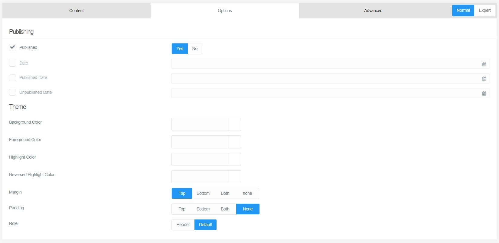

***From the official GRAV documentation:***
The concept of Modular Pages is a little tricky to get your head around at first, but when you do you'll see how convenient they are to use. A Modular Page is a collection of pages stacked on top of each other to create a unified, single page. This lets you create a complex page-structure by using the LEGO building-brick-approach, and who doesn't love LEGO?!  
[Continue reading...](https://learn.getgrav.org/16/content/modular)

## Adding a modular to our parent.
We will now add a modular using the relatively unopionated Content modular, mainly used for text, embedding stuff (images, videos) and using shortcodes.

From the Page section or from inside any page...
* Click on the **small arrow pointing down next to the +Add button** (top right) and select **Modular**.
* Give it a title (folder name will fill automatically).
* **Page:** choose the the [previously created page](#adding-a-modular-page) as a target.
* **Modular Template:** Select Content.
* Click **Continue**.
* Just like when creating the page, you should save (top-right or ctrl+s).
* Add some content and go check out your page!

## Hotdoy Theme twist on modular

This here theme adds a small twist to modular foundation by adding color theme and spacing controls on all of them.
If you head to the Options tab in a modular you'll see pretty much this...
