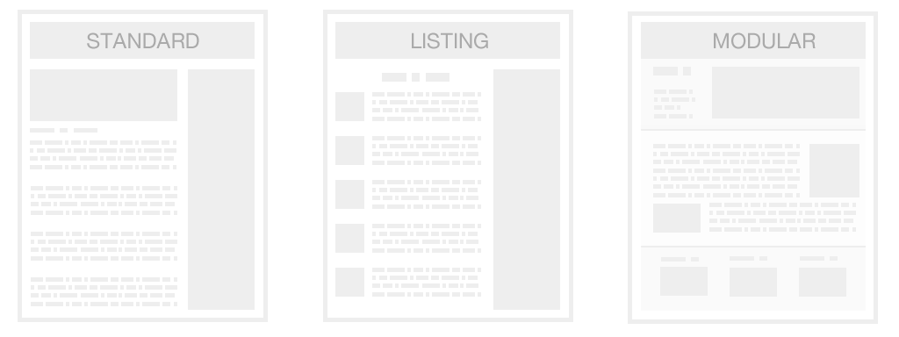
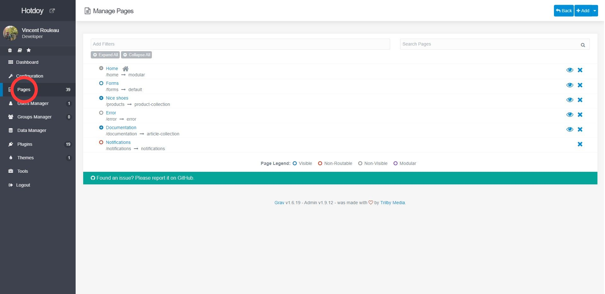
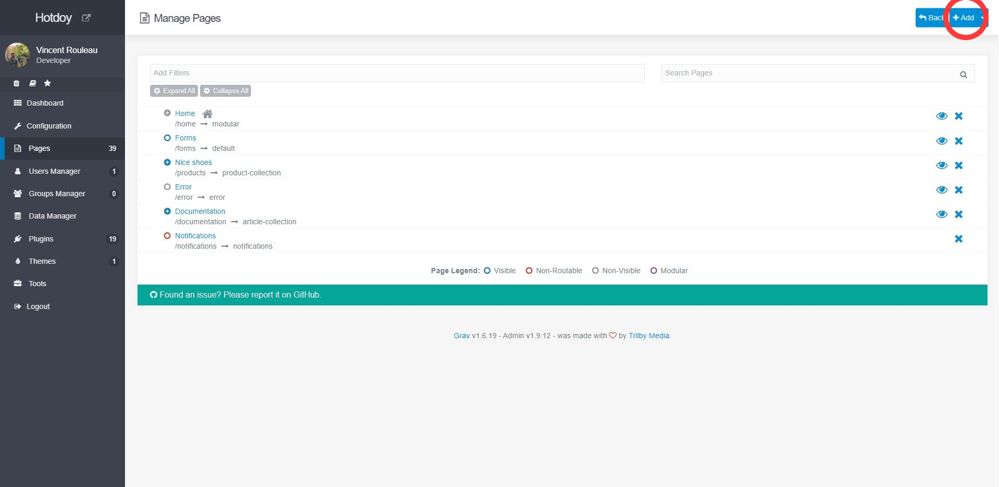
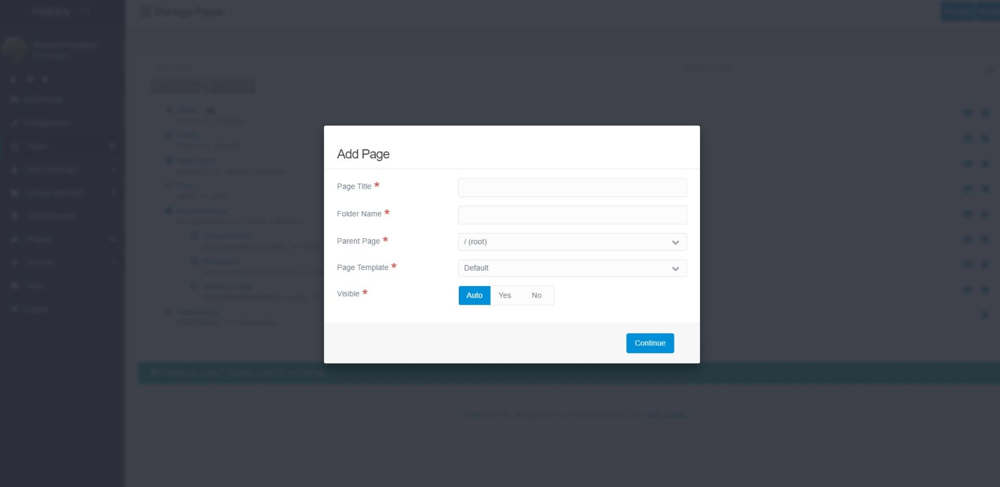
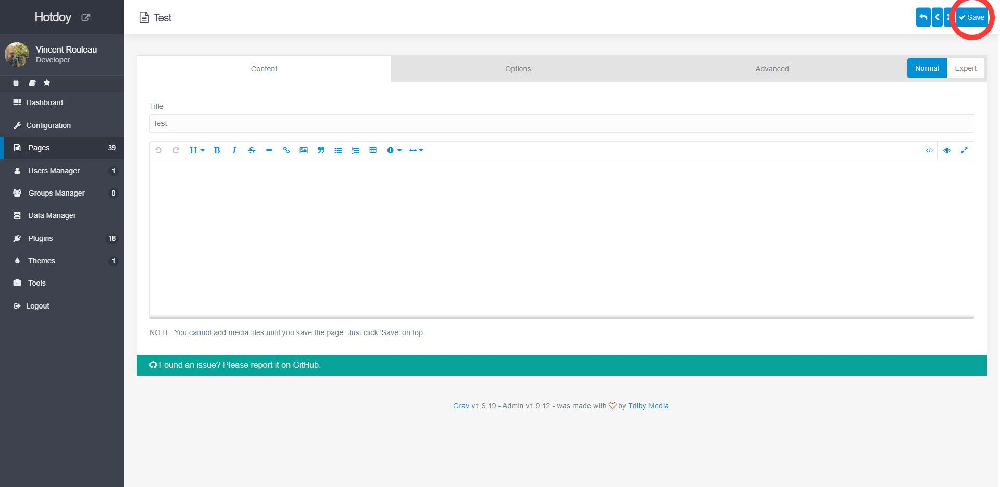

**This is a rundown of the steps you should take to create a page from the admin panel.
I strongly suggest reading the official grav documentation first so you understand the concept of a page**

[link href="https://learn.getgrav.org/16/content/content-pages" mi="open_in_new"]Read on getgrav[/link]

Pages are the fundamental building blocks of your site. They are how you write content and provide navigation, even just store data or configurations.
All pages are created equal, then use a template to give them a purpose. Some will become articles, some collection or listing and other will host modules to become landing pages. You might even create pages just to store content you use in another page.



## Adding a page

Make sure you are logged the Grav admin panel and head for the **Pages section** where you will be presented an overview of the entire site.



Click the **Add+** button (top right). to open the "Add Page" modal and **fill the form**.



**Title**  
will give the page it's title and generate a folder name for you.
You can of course change to folder name for whatever you need it to be.

**Parent Page**   
will let you choose where, in your website, to add the page.
```/root``` being just under your home page.



**Page Template**  
Here you can choose from any page template provided by the theme. **Select Default** for now.

Hit **Continue** and you will be brought to your new page! 

Type something in (anything really) and hit **save**! This will create the page on your server and you will then be able to see your new page in all it's glory by entering the url in your browser or simply pressing the little eye icon in the top right corner.



That's it! If you have questions or need more personalized help, you can always [open an issue on Github](https://github.com/hotdoy/grav-theme-hotdoy/issues)